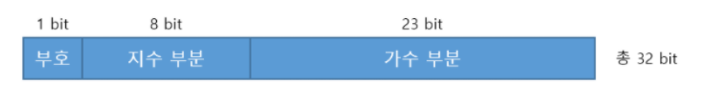
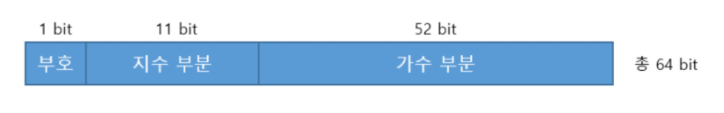
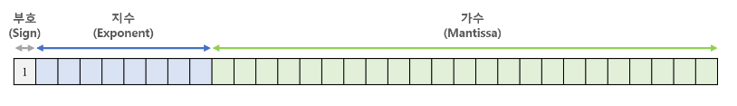
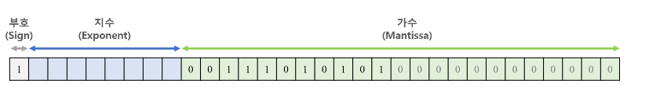
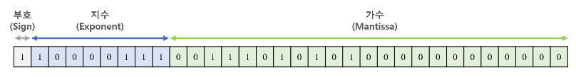

# JAVA_SYNTAX
## Variables 변수
- 하나의 값을 저장하기 위해 확보한 메모리 공간 자체 또는 그 메모리 공간을 식별하기 위해 붙인 이름(식별자-Identifier)
- Mangaged Language: 자바는 개발자가 직접 메모리를 제어하지 못함. 직접 메모리 주소를 통해 값을 저장하고 참조할 필요 없이 변수를 통해 안전하게 값에 접근이 가능
- 식별자(변수명)는 변수의 값이 아닌 메모리 주소를 기억. 변수명을 사용하면 변수명과 매핑된 메모리 주소를 통해 메모리에 저장된 값을 반환
- 선언(deciaration): 변수명을 컴파일러에 알리는 행위
- 할당(assignment, 대입, 저장): 변수에 값을 저장하는 행위
- 참조(reference): 변수에 저장된 값을 읽어들이는 행위

### 변수 스코프
- 스코프: 변수에 접근하거나 접근할 수 있는 유효 범위. 일반적으로 변수가 선언된 블록 내.{}으로 구분.
- 라이프타임: 변수가 메모리 내에서 존재할 수 있는 시간.
```java
public class Sample {
    // 변수 선언
    int x, y;           // Instance Variable: 클래스 내부에 선언된 변수, main 메소드에 영향을 미치기 위해서는 인스턴스 선언이 필요.
    static int result;  // Class Variable: 클래스 내부에 선언된 static 변수
    
    void add(int a, int b){    // Local Variable이 매개변수(Parameter)로 활용
        // 변수에 값 할당
        x = a;
        y = b;
        int sum = x + y;    // 선언과 동시에 할당: 초기화
        System.out.println("Sum = "+sum);
    }

    public static void main(String[] args) {
        Sample obj = new Sample();  // 인스턴스 선언
        obj.add(10, 20);
    }
}

/*
 * Instance Variable
 *  - 클래스 내부와 모든 메소드 및 블록 위부에서 선언된 변수
 *  - scope: 정적 메소드를 제외한 클래스 전체
 *  - 라이프타임: 객체가 메모리에 존재할 때까지
 * 
 * Class Variable
 *  - 클래스 내부, 모든 외부 블로에서 선언되고 static으로 표시된 변수
 *  - scope: 클래스 전체
 *  - 라이프타임: 프로그램이 끝날 때까지
 *
 * Local Variable(지역변수)
 *  - 인스턴스 및 클래스 변수가 아닌 모든 변수
 *  - scope: 선언된 블록 내
 *  - 라이프타임: 컨트롤이 선언 된 블록을 떠날 때까지
 */
```

## 데이터 타입
### 타입의 종류
- 일반형(Primitive Type)
    - 정수형
        - int(기본): 32bit(4byte)
        - short: 16bit(2byte), 할당 할 시 s를 붙임.
        - byte: 8bit(1byte), 할당 할 시 b를 붙임.
        - long: 64bit(8byte), 할당 할 시 l를 붙임.
    - 실수형
        - float: 32bit(4byte), 할당 할 시 f를 붙임.
        - double(기본): 64bit(8byte)
    - 문자형
        - char: 16bit(2byte)
    - 논리형
        - Boolean: 8bite(1byte)
- 참조형(Reference Type)
    - 열거형
    - 클래스형
    - 인터페이스형

### 부동소수점(IEEE754 방식)
- 실수를 표현하기 위해 소숫점의 위치를 이동시키는 표현법



- 가수(Mantissa): 실제 값을 저장하는 부분
- 지수(Exponent): 실수의 크기를 표현하는 부호가 있는 정수
- 부호(Sign bit): 0이면 양수, 1이면 음수
- 2.74*10^14의 경우 가수=2.74, 지수=14, 부호는 0
- (예시) -314.625를 부동소수점으료 표현(float)
    1. 부호부: 음수이므로 32비트 가장 앞은 1
    
    2. 가수부
        - 절댓값을 2진수로 표현 -> 100111010.101(2)
        - 소숫점 이동 -> 1.00111010101 * 2^8(2)
        - 소수점의 오른쪽 부분(00111010101)을 가수부 23비트의 앞에서부터 채우고 남은 자리는 0으로 채움.

        
    3. 지수부
        - 지수 8에 bias인 127을 더함. = 135 = 10000111(2)
        - bias: 지수 부분의 음수와 양수를 구분하기 위해 더하는 2^(k-1)
        - k는 지수부의 비트수 8, double의 경우 11

        

### 컴퓨터의 음수
- 음수: 양수와 더해서 0이되게 하는 값.
- 보수: 보충해 주는 수. 어떤 수 A가 B가 되기 위해 필요한 수
    - 예. 10진수 3의 10의 보수는 7.
- 2진수의 경우 2의 보수는 10(2)이 되는 값.
- 2의 보수 값을 더하게 되면 맨 왼쪽 비트가 1로 증가해 사라짐(Truncate), 다른 수는 모두 0.
- 앞에서 언급한 음수의 역할과 같다.
- 예. 10진수 3(이진수 11)을 4비트로 표현한 수 0011에 1101을 더하면 0000.
- 2진수를 모두 뒤집은 후에 1을 더하면 2진수에서 2의 보수를 만들 수 있다.

### 형 변환(Type Conversion)
- 데이터 타입이 다른 변수들 간의 연산 시 타입을 동일하게 바꾸는 것.
- 묵시적 형 변환(자동 형 변환)
    - 바이트 크기가 작은 자료형에서 큰 자료형으로 형 변환은 자동.
    - 덜 정밀한 자료형 -> 더 정밀한 자료형
    - 예. int iNum = 20; => float fNum = iNum;
- 명시적 형 변환(강제 형 변환)
    - 바이트 크기가 큰 자료형에서 작은 자료형으로 대입
    - 더 정밀한 자료형 -> 덜 정밀한 자료형
    - 예. int iNum = 1000; => byte bNum = (byte)iNum;
    - 위 예는 1000이 byte형 범위 -128~127 범위를 넘기 때문에 자료손실-> -24로 출력됨.

